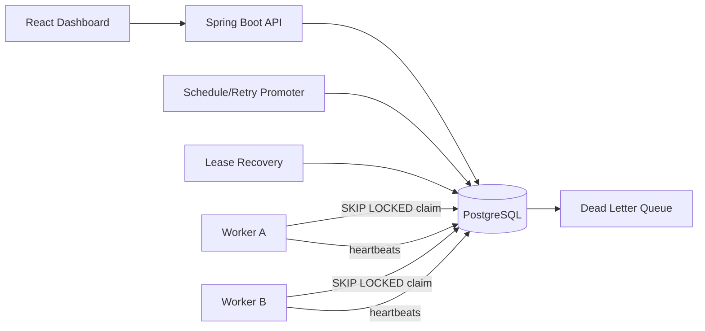

# Architecture

PostgreSQL is the correctness boundary. Workers claim in short transactions and execute outside the transaction. Queue-scoped advisory transaction locks protect concurrency-limit checks. Independent queues still claim concurrently. Leases recover jobs from crashed workers. The system deliberately promises at-least-once execution.
