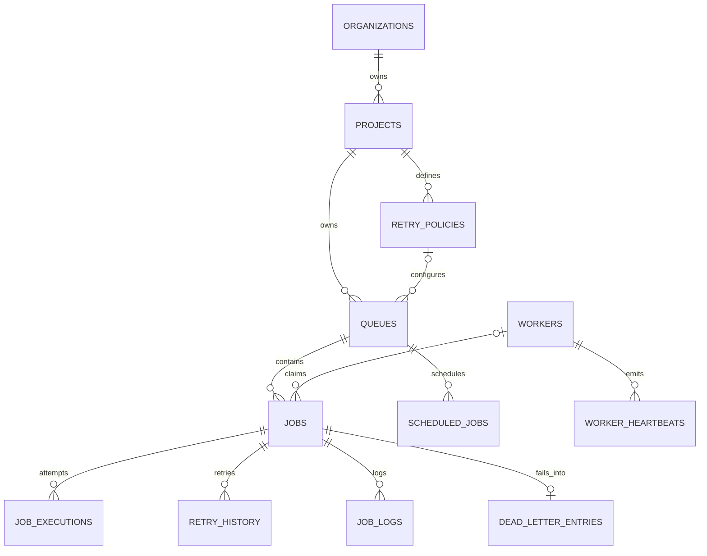

# ER Diagram

```mermaid
erDiagram
 ORGANIZATIONS ||--o{ PROJECTS : owns
 PROJECTS ||--o{ QUEUES : owns
 PROJECTS ||--o{ RETRY_POLICIES : defines
 RETRY_POLICIES o|--o{ QUEUES : configures
 QUEUES ||--o{ JOBS : contains
 QUEUES ||--o{ SCHEDULED_JOBS : schedules
 WORKERS o|--o{ JOBS : claims
 WORKERS ||--o{ WORKER_HEARTBEATS : emits
 JOBS ||--o{ JOB_EXECUTIONS : attempts
 JOBS ||--o{ RETRY_HISTORY : retries
 JOBS ||--o{ JOB_LOGS : logs
 JOBS ||--o| DEAD_LETTER_ENTRIES : fails_into
```
